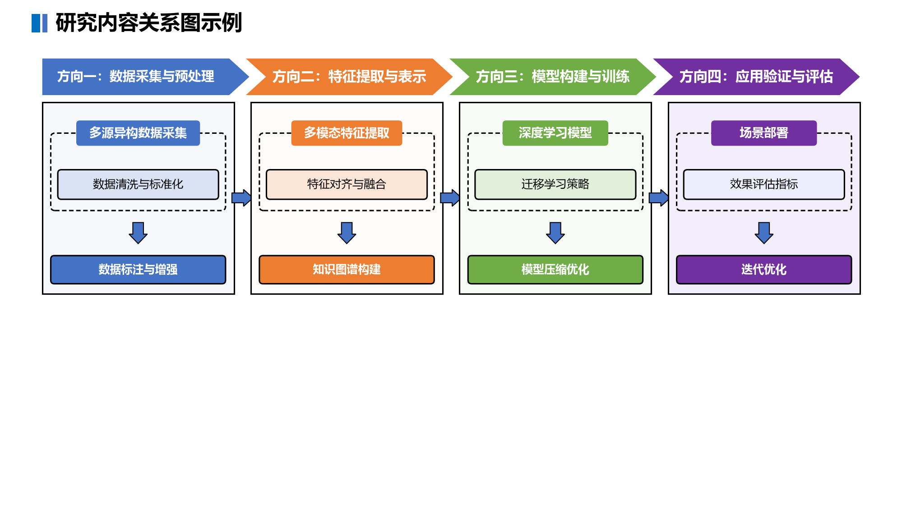
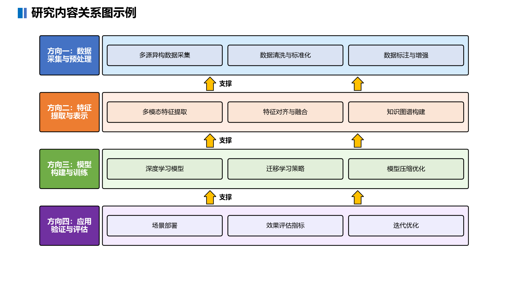
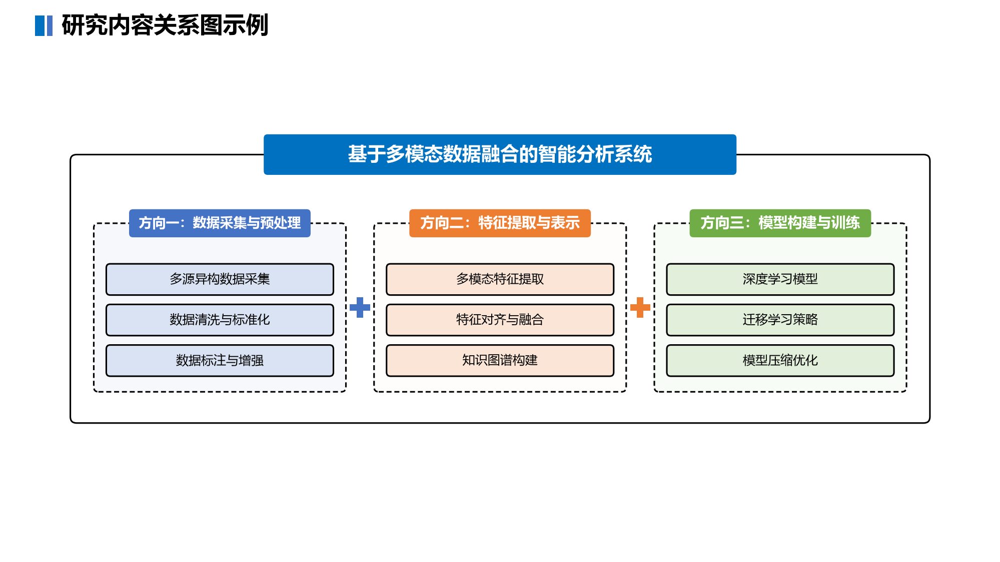
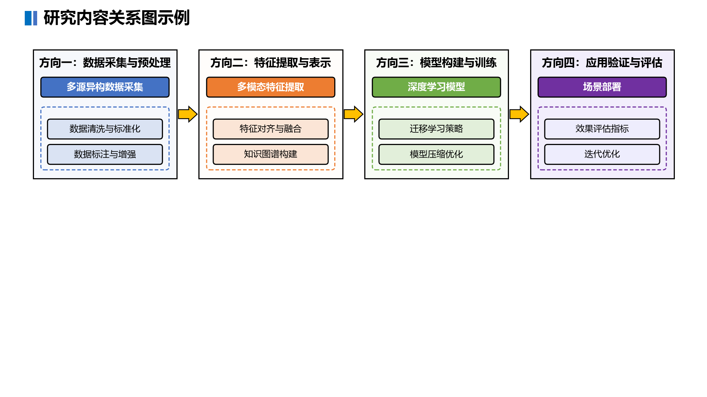

# pptx-figure-skill

一个 [Claude Code](https://claude.com/claude-code) Skill：根据 Markdown 文件生成**学术项目申报书风格**的架构图、技术路线图、总-分关系图。输出 **PowerPoint 可导入的矢量 SVG**（可"转换为形状"变成原生可编辑图形）、PNG 或 Mermaid。

风格体系逆向自某 41 页学术项目申报 PPT 图集——通过逐页渲染视觉分析 + OOXML 形状级数据提取，
归纳出完整的配色系统、组件词汇表、9 种布局原型与反面清单，再用组件库参数化复现。

## 效果示例

| 版式 | 适用场景 | 示例 |
|---|---|---|
| `route` 燕尾页签+泳道 | 技术路线、阶段流程 |  |
| `architecture` 分层架构 | 平台/系统分层、支撑关系 |  |
| `overview` 总-分关系 | 研究内容总览、A+B+C组合 |  |
| `panel` 多栏技术板 | 模块并列、子任务分解 |  |

> 上图为 PNG 预览。同样内容可输出 `.svg` 矢量图（见 `examples/sample_*.svg`），
> 在 PowerPoint 中「插入 > 图片」导入后可无损缩放，并可「图形工具 > 转换为形状」
> 拆成原生可编辑的圆角矩形 / 文本框 / 连接线。实测 4 种版式均被 PowerPoint 识别为
> 原生 SVG 图形（msoGraphic）并正确渲染。

## 风格签名

- **浅色 tint 填充 + 黑色 1.5pt 实线边框 + 黑字**为主导（≈70%）；标题粗体、正文常规
- **深饱和色只用于窄条**：总标题条、燕尾页签、结论条（白粗体；金色 FFC000 上配黑字）
- **sysDash 虚线框 = 逻辑分组**，配"骑缝标签"（饱和色标题条骑压框线）
- **块状实心箭头做宏观流程**（金黄+黑描边=支撑主线），细线连接器只做微观汇聚
- **一区一色**：六色系（蓝/橙/金/绿/紫/灰）× 四档深浅（近白底板→浅带→卡片→饱和）

## 安装

把 `.claude/skills/pptx-figure/` 复制到你项目的 `.claude/skills/` 目录：

```bash
git clone https://github.com/lidelinsdu/pptx-figure-skill.git
cp -r pptx-figure-skill/.claude/skills/pptx-figure  你的项目/.claude/skills/
```

依赖：**SVG 输出无需任何第三方库**（纯标准库）。PNG 输出需 `pip install matplotlib`，
且中文渲染需中文字体：Windows 自带微软雅黑；Linux/WSL 可安装 `fonts-noto-cjk`/`fonts-wqy-zenhei`，
或把 Windows 的 `C:\Windows\Fonts\msyh.ttc` 拷入 `~/.local/share/fonts/` 后执行 `fc-cache -f`
并删除 `~/.cache/matplotlib`。

## 使用

在 Claude Code 中直接说"用 pptx-figure 给这个 md 画技术路线图"，或命令行：

```bash
# 生成 PPTX 可导入的矢量 SVG（推荐）
python .claude/skills/pptx-figure/generate-figure.py research.md -o figure.svg

# 自动选型生成 PNG
python .claude/skills/pptx-figure/generate-figure.py research.md -o figure.png

# 指定版式: route / panel / architecture / overview
python .claude/skills/pptx-figure/generate-figure.py research.md -o figure.svg --type route

# 输出 Mermaid 代码
python .claude/skills/pptx-figure/generate-figure.py research.md -o diagram.mermaid
```

**输出格式由 `-o` 扩展名决定**：`.svg` 矢量（PPT 可导入/转形状，无需 matplotlib）、
`.png` 栅格（需 matplotlib）、`.mermaid` 源码。

### 输入 MD 约定

```markdown
# 图表总标题                ← 含"路线/架构/总览"等词可触发自动选型

## 阶段/层/分组标题          ← 章节 = 页签/层/分组
- 条目1                     ← route/panel: 首条 = 骑缝标签(深色标题卡)
- 条目2                     ← 其余条目 = 浅色内容卡
- 条目3                     ← route 中≥3条时末条 = 底部结论条
```

### 组件库 API（自定义复杂图）

```python
import sys; sys.path.insert(0, '.claude/skills/pptx-figure/templates/python')
import pptx_style_base as S

S.set_backend('svg')                                        # 'svg'矢量 / 'mpl'栅格(默认)
fig, ax = S.init_figure()                                   # 1280×720，原点左下
S.page_header(ax, '页面标题')                                # 左上角蓝块+黑粗体
S.card(ax, x, y, w, h, family='blue', text='内容卡')         # 浅底黑边黑字
S.deep_card(ax, x, y, w, h, family='blue', text='标题卡')    # 饱和底白粗体
S.dashed_group(ax, x, y, w, h, label='骑缝标签')             # 虚线分组+骑缝标签
S.chevron_row(ax, x, y, [320]*3, 52, ['阶段一','阶段二','阶段三'])  # 燕尾页签
S.block_arrow(ax, cx, cy, 'up', style='gold', note='支撑')   # 块状箭头+旁注
S.layer_band(ax, x, y, w, h, family='blue', label='应用层')  # 全宽层带+侧标签
S.side_label(ax, x, y, 50, 300, '竖排标签', family='blue')   # 伪竖排侧标签
S.cylinder(ax, cx, y, 95, 90, '数据库')                      # 数据库圆柱
S.save(fig, 'out.svg')   # 扩展名决定格式：.svg矢量 / .png栅格
```

同一套组件代码对两个后端通用；SVG 后端为手写内联属性（无 CSS/defs/clip），PowerPoint 导入友好。

## 目录结构

```
.claude/skills/pptx-figure/
├── skill.md                                # Claude入口：风格签名+调用方式
├── generate-figure.py                      # 生成脚本（4种版式原型+Mermaid）
├── style-reference/complete-style-guide.md # 完整风格指南（配色/组件/9原型/反面清单）
├── templates/python/pptx_style_base.py     # 双后端组件库（SVG矢量 + matplotlib栅格）
├── templates/mermaid/                      # Mermaid模板与主题
└── examples/                               # 示例输入与输出（.svg + .png）
```

## 方法论

风格提取流程（可复用于其他 PPT 风格逆向）：

1. PowerPoint COM 把全部幻灯片渲染为 PNG
2. 解析 OOXML 逐页提取形状坐标/填充/边框/文字/字号到 JSON
3. 逐页"渲染图+数据"双源视觉分析（41 个并行分析），三路综合归纳：配色规则 / 组件词汇表 / 布局原型目录
4. 关键发现驱动实现：XML 里的主题基色在渲染时带 60-80% 透明浅化——生成器必须直接写浅化后的 hex

## License

[MIT](LICENSE)
